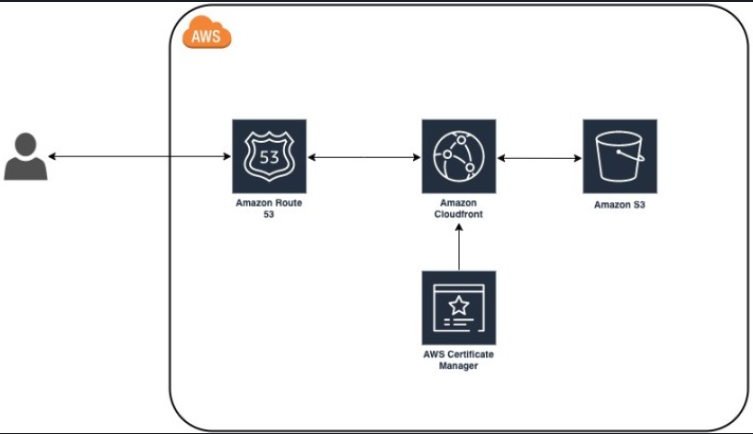
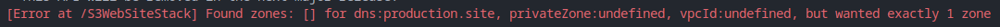
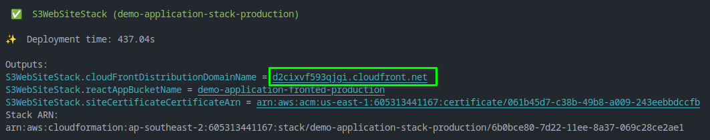
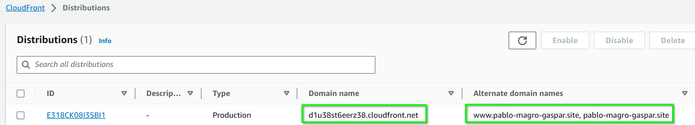
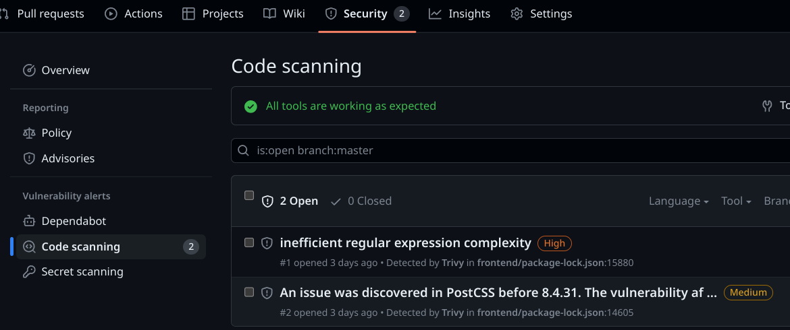
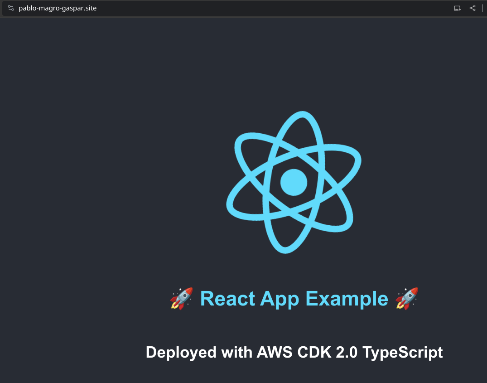

<h1 align="center">AWS Deployment Project</h1>
<h6 align="center">This repository will aggregate future assessment</h6>

<p align="center"></p>

## Table of Contents
- [Infrastructure Architecture Diagram and Design](#infrastructure-architecture-diagram-and-design)
- [Application Diagram](#Application-Diagram)
- [Deployment Process](#Deployment-Process)
- [Prerequisites](#prerequisites)
- [Repository Folder structure](#Repository-Folder-structure)
- [Deployment Instructions](#Deployment-Instructions)
- [GitHub Actions](github_actions.md)
- [Improvement Points For The Future](#Improvement-points-for-the-future)

## Infrastructure Architecture Diagram and Design - Route53 + CloudFront - S3 Bucket

The following AWS services and architecture can be used to deploy a React application to AWS using TypeScript and CDK, considering scalability, resilience, and cost-effective:

### Scalability:
1. Amazon S3: S3 is a highly scalable object storage service that can be used to store the static files of the React app.
1. Amazon CloudFront: CloudFront is a content delivery network (CDN) that can be used to distribute the React app to users around the world with low latency and high availability.

### Resilience:
1. Amazon Route 53: Route 53 is a highly available DNS service that can be used to route traffic to the CloudFront distribution.
1. Amazon Certificate Manager (ACM): ACM is a service that can be used to create and manage SSL/TLS certificates for CloudFront. This will ensure that your website is served over HTTPS.

### Cost:
1. S3: S3 is a relatively inexpensive service, especially for storing static files.
1. CloudFront: CloudFront pricing is based on the amount of data transferred and the number of requests made. However, there is a free tier that allows for a certain amount of data transfer and requests per month; it will be sufficient for most small to medium-sized websites.
1. Route 53: Route 53 is also a relatively inexpensive service.
1. ACM: ACM is a free service.

### Architecture:
The following diagram shows a high-level architecture of the proposed solution:

[Diagram of the proposed solution]

  **User** -> **Route 53** -> **CloudFront** -> **S3**



### Comparison of Cost with Other Solutions
The cost of the proposed solution will vary depending on the amount of data that is transferred and the number of requests that are made to CloudFront. However, the free tier of CloudFront will be sufficient for most small to medium-sized websites.

Compared to other solutions, such as hosting the React app on a traditional web server, the proposed solution is generally more cost-effective, especially for high-traffic websites. This is because CloudFront is designed to efficiently distribute content to users around the world, which can reduce bandwidth costs. Additionally, the free tier of CloudFront can be used to host low-traffic websites at no cost.

## Application Diagram

## Deployment Process
+ Infrastructure deployment via AWS CDK.
+ Application deployment via GitHub actions.

## Prerequisites

### Applications and tools
To deploy all infrastructure you will need below application to be installed on your workstation/server.

+ Install [Node.js](https://nodejs.org/en/learn/getting-started/how-to-install-nodejs) on your workstation/server
+ Install [GIT](https://github.com/git-guides/install-git) on your workstation/server.
+ Install [AWS CDK](https://aws.amazon.com/getting-started/guides/setup-cdk/module-two/) on your workstation/server
+ Install [aws cli](https://docs.aws.amazon.com/cli/latest/userguide/install-cliv2.html) on your workstation/server

### AWS User and tokens
+ Access to your Console AWS and [create a user](https://docs.aws.amazon.com/IAM/latest/UserGuide/id_users_create.html) for terraform deployment with the right permissions. Save it for later
+ Access to your Console AWS and [create a user](https://docs.aws.amazon.com/IAM/latest/UserGuide/id_users_create.html) for GitHub action deployments with the right permissions. Save it for later

### AWS Cli configurations
+ Configure your [AWS Cli](https://docs.aws.amazon.com/cli/latest/userguide/cli-configure-profiles.html)

### Github configurations
+ Create [Personal access tokens](https://docs.github.com/en/enterprise-server@3.4/authentication/keeping-your-account-and-data-secure/creating-a-personal-access-token) on Github and save it for later
+ Create [Github Actions secrets](https://docs.github.com/en/actions/security-guides/encrypted-secrets) as below and add your data:

```
AWS_ACCESS_KEY_ID
AWS_SECRET_ACCESS_KEY
AWS_DEFAULT_REGION
E2E_FRONTEND_BASE_URL
SONAR_TOKEN
```

+ Enable [Github code scanning](https://docs.github.com/en/code-security/code-scanning/automatically-scanning-your-code-for-vulnerabilities-and-errors/setting-up-code-scanning-for-a-repository) for a repository

## Repository folder structure
```bash
.
├── .github
│   └── workflows
├── infrastructure
│   ├── lib
│   ├── bin
│   └── test
├── images
└── frontend
    ├── src
    ├── cypress
    └── public
```
- /.github/workflows - All the pipelines for GitHub actions. <br />
<!-- - /backend - Backend application folder and docker file. <br /> -->
- /frontend - Frontend application folder and Docker files. <br />
- /images - All print screens for README.md files. <br />
<!-- - network-address-design - Network address allocation for this project. <br /> -->
- /infrastructure - CDK TypeScript files for infrastructure deployment on AWS. <br />

## Deployment Instructions
### S3 Bucket Website
Infrastructure deployment will be completed via CDK locally. However before proceed with the deployed a AWS Route53 Hosted Zone, has be created in advance and setup within the `cdk.json` file and the `domainName` parameter , otherwise you'll get below error:



1. Clone [GitHub](https://github.com/pablomagro/react-nodejs-typescript-mongodb-cicd) project to your local. <br /> <br />

3. Access to terraform folder and run below commands. They two environment variables which can be setup either to specify AWS account and AWS region where the infrastructure is going to be deployed. It can be archived via CLI or just setting those values within the `cdk.json` file.

```
CDK_DEFAULT_ACCOUNT
CDK_DEFAULT_REGION
```

```bash
cd infrastructure

# Having setup the cdk.json file.
npm run deploy:production

# or using environment variables.
CDK_DEFAULT_ACCOUNT=1234567890 CDK_DEFAULT_REGION=ap-southeast-1 npm run deploy:production
```
## Application URL
### S3 Bucket Website
To find Application URL please check the console after the CDK command is completed:



Also it can be found the AWS CloudFront console:



### Application FE BE & LB:
| Description | Source | Source Port | Destination  | Destination Port | Protocol |
| ----------- | ------ | ----------- | ------------ | -----------------| -------- |
| Frontend | * | * | Backend | 80 | HTTP |
| HTTP to ELB from Internet | * | *  | ELB | 80 | TCP |

## Vulnerability Check
In this Project I am using Trivy vulnerability tool for Docker images and SonarCloud for detecting bugs, vulnerabilities and code smells.

### Analyze your code for free with [SonarCloud](https://github.com/SonarSource/sonarcloud-github-action)
Using this GitHub Action, scan your code with SonarCloud to detects bugs, vulnerabilities and code smells in 26+ programming languages! In case
you want to analyze C and C++ code: rely on our SonarCloud Scan for C and C++ and look at our sample C and C++ project

### [TODO] Docker image Vulnerability Check via Trivy
I integrated Trivy in my GitHub Actions pipeline.
When we have Git push or pull requests to related Frontend, Backend, folders and files on "main" branch Github Actions will be trigger.
Pipeline will create:

- Docker image
- Docker image vulnerability check (with report)
- Upload Docker image to docker hub if we don't have Critical vulnerability issue.

#### [TODO] Github Actions - Trivy report for Docker image Vulnerability

### Code scan vulnerability Check via Trivy
For the code scan I used Trivy as well.
I integrated Trivy with Github Actions & created workflow to scan my code when push and pull request created.
Will failed the build when discovered critical vulnerability issues.



## Deployed Applications


## Other Useful Documentation

### Test GitHub Actions
To execute a workflow on a branch that differs from the default branch of the repository, make use of the `--ref` flag.

```bash
gh workflow list
gh workflow run 'Deploy React app to AWS - S3 Website' --ref feature/trigger-workflow-again
```

## Improvement Points For The Future
- [TODO] Creating helm chart for Backend and Frontend app.
- [TODO] Creating Metric monitoring with Prometheus, Node Exporter and Grafana.
- [TODO] Creating LogGing Monitoring with Elasticsearch, Kibana, Logstash, Filebeat.
- [TODO] Creating Alert manager & integrate it with slack to send msg for Critical problems.
- [TODO] Creating CD with ArgoCD on EKS cluster.
