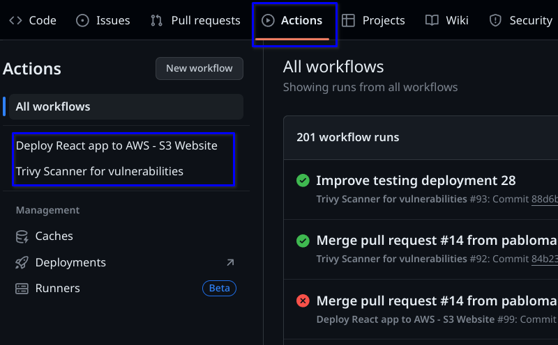
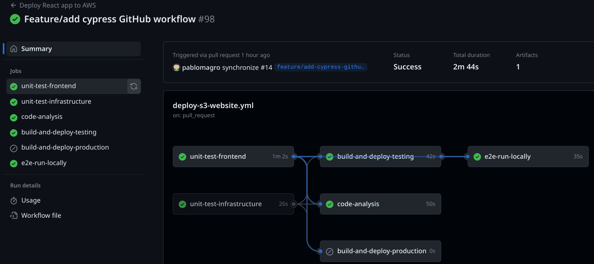
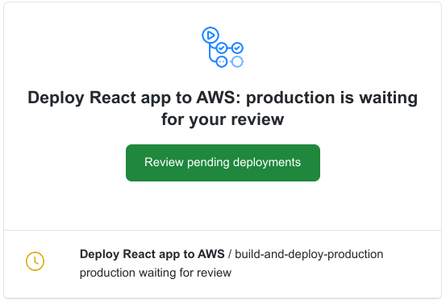

<h1 align="center">GitHub Actions</h1>
<h6 align="center">This README will describe all GitHub Actions workflows in the Project</h6>

## Application diagram

Actions link : https://github.com/pablomagro/react-nodejs-typescript-mongodb-cicd/actions

## Table of Contents

- [Deploy React app to AWS - S3 Website](#Deploy-React-app-to-AWS---S3-Website)
- [Deploy React app to AWS - Docker and Fargate](#Deploy-React-app-to-AWS---Docker-and-Fargate)
- [Trivy Scanner for vulnerabilities](#Trivy-Scanner-for-vulnerabilities)

## GitHub Actions Frontend Deployment - S3 Bucket

**Production** deployment requires Manual Approval (setup via environments)

  

## GitHub Actions Frontend Deployment - Docker and Fargate
<!--  -->
