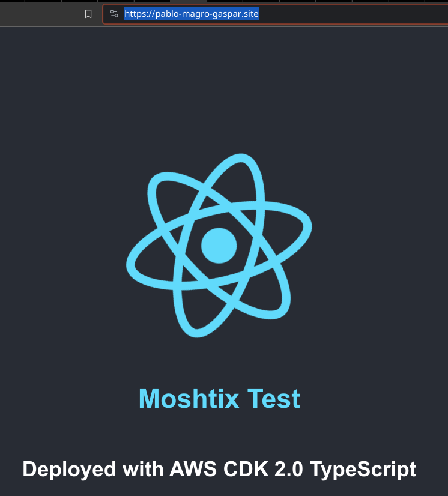
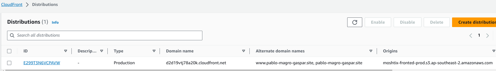

# AWS Services and Architecture Design.

The following AWS services and architecture can be used to deploy a React application to AWS using TypeScript and CDK, considering scalability, resilience, and cost-effective:

## Scalability:

1. Amazon S3: S3 is a highly scalable object storage service that can be used to store the static files of the React app.
1. Amazon CloudFront: CloudFront is a content delivery network (CDN) that can be used to distribute the React app to users around the world with low latency and high availability.

## Resilience:

1. Amazon Route 53: Route 53 is a highly available DNS service that can be used to route traffic to the CloudFront distribution.
1. Amazon Certificate Manager (ACM): ACM is a service that can be used to create and manage SSL/TLS certificates for CloudFront. This will ensure that your website is served over HTTPS.

## Cost:

1. S3: S3 is a relatively inexpensive service, especially for storing static files.
1. CloudFront: CloudFront pricing is based on the amount of data transferred and the number of requests made. However, there is a free tier that allows for a certain amount of data transfer and requests per month; it will be sufficient for most small to medium-sized websites.
1. Route 53: Route 53 is also a relatively inexpensive service.
1. ACM: ACM is a free service.

## Architecture:

The following diagram shows a high-level architecture of the proposed solution:

[Diagram of the proposed solution]

  **User** -> **Route 53** -> **CloudFront** -> **S3**

## Comparison of Cost with Other Solutions

The cost of the proposed solution will vary depending on the amount of data that is transferred and the number of requests that are made to CloudFront. However, the free tier of CloudFront will be sufficient for most small to medium-sized websites.

Compared to other solutions, such as hosting the React app on a traditional web server, the proposed solution is generally more cost-effective, especially for high-traffic websites. This is because CloudFront is designed to efficiently distribute content to users around the world, which can reduce bandwidth costs. Additionally, the free tier of CloudFront can be used to host low-traffic websites at no cost.

## Deployment Result

- React Application hosted on AWS

- Cloud Formation Distribution

- Route53 Hosted Zone

